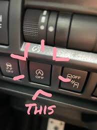

<h1>Alex Baron Journal</h1>

<h2>Journal Entry #1</h2>
<h3>Subaru Crosstrek</h3>
<em>Alexander Baron<em></em>   03-14-25  

When I am driving my Subaru Crosstrek 2021, and I come to a stop, the car turns off on its own. Then, when I start moving again, the engine turns back on, so I start looking at my dashboard to see if anything is different. When I came back to a stop, a little green icon popped up on the dashboard, and when I started moving again, it went away. At the next stop, it happened again, so I started searching around the car for a reason for this happening. All I could find was this button to the left of the wheel, which looked just like the symbol that popped up on the dashboard. So I pressed it, and my car turned back on without me moving.

At first, I was very confused about why this happened. I found out that there was a feature in the Crosstrek that turns the car off to save fuel or something. I've learned to turn it off by pressing a button to the left of the wheel. I've sort of created a mental model where I can just turn it off without having to search for the button. It's cool because when I do successfully hit the button, the engine turns back on, so I am getting feedback telling me whether or not I pressed the right button.  

<h2>Journal Entry #2</h2>
<h3>Subaru Crosstrek</h3>
<em>Alexander Baron<em></em>   05-12-25  

  When I am driving my Subaru Crosstrek 2021, I noticed something unusual - when I come to a stop, such as at a traffic light, the engine would turn off automatically. At first, this made me anxious, I thought the car might have malfunctioned. Then, as I took my foot off the brake, the engine turned back on. A small green icon appeared on the dashboard whenever the engine shut off, and it disappeared when the engine restarted. Curious and confused, I scanned the dashboard and the surrounding areas to figure out what was going on. To the left of the steering wheel, I noticed a button with the same icon that had appeared on the dashboard circular arrow with an "A" in the middle. Pressing it caused the engine to start back up instantly, even though the car hadn't moved.

  After some trial and error and a bit of online searching, I discovered the Auto Stop-Start feature, designed to save fuel and reduce emissions by turning off the engine while the vehicle is idle. I found the sudden silence and restart distracting, especially in stop-and-go traffic, so I decided to turn it off regularly using the button

  
  Over time, I developed a **mental model**: I now associate that specific symbol (the circular arrow tih an "A") with the Auto Stop-Start system. Because I've learned the button's location and function through repeated use, I can now instinctively reach for it without searching. When I press it, I get immediate feedback: the engine restarts, and the green dashboard icon disappears. This kind of **feedback**- direct and immediate - helps reinforce the action.

  I did find the learning curve slightly frustrating. There was no audible cue or detailed explanation from the dashboard interface when the feature was first activated. The button itself wasn't prominently labeled, I had to rely on matching symbols to figure things out. A suggestion for improvement could be providing a short tooltip or message on the dashboard the first time the feature activates, this would've clarified things quickly. Additionally, placing the button in a more visible or intuitive location would help first-time users.

